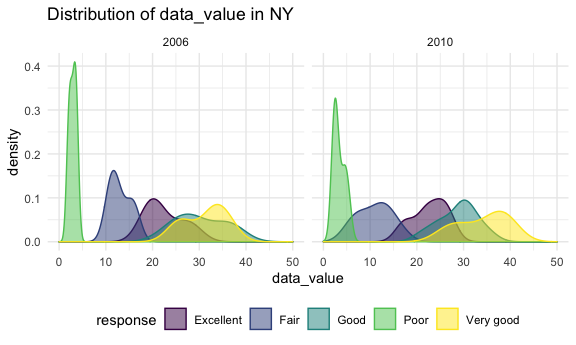

Homework 3
================
Zoey Zhao
10/16/2021

Load packages, install `p8105.datasets`, and set the theme for plots.

``` r
library(tidyverse)
#install.packages("p8105.datasets")
library(p8105.datasets)
library(ggplot2)

knitr::opts_chunk$set(
  fig.width = 6,
  fig.asp = .6,
  out.width = "90%"
)

theme_set(theme_minimal() + theme(legend.position = "bottom"))

options(
  ggplot2.continuous.colour = "viridis",
  ggplot2.continuous.fill = "viridis"
)

scale_colour_discrete = scale_colour_viridis_d
scale_fill_discrete = scale_fill_viridis_d
```

## Problem 1

The data set `instacart` has 15 observations including the order\_id,
product\_id, add\_to\_cart\_order, reordered, user\_id, eval\_set,
order\_number, order\_dow, order\_hour\_of\_day,
days\_since\_prior\_order, product\_name, aisle\_id, department\_id,
aisle, department. It has a total of 1384617 rows and 15 columns.
`reordered` is a numeric variable that only has 1 and 0. `eval_set` is a
character variable that only has “train”. `product_name` is a character
variable that represents names of products (e.g. Grated Pecorino Romano
Cheese). `aisle` is a character variable (e.g. specialty cheeses).
`department` is also a character variable with 21 different types
(e.g. dairy eggs). Others are all numeric variables with different
ranges.

**1.** How many aisles are there, and which aisles are the most items
ordered from?

``` r
data("instacart")

grouped_by_aisle <- 
  instacart %>%
  group_by(aisle) %>%
  summarize(n_obs = n())

#Show top 5 aisles with most items ordered
arrange(grouped_by_aisle, n_obs)%>%
  tail(n = 5)%>% 
  knitr::kable()
```

| aisle                      | n\_obs |
|:---------------------------|-------:|
| packaged cheese            |  41699 |
| yogurt                     |  55240 |
| packaged vegetables fruits |  78493 |
| fresh fruits               | 150473 |
| fresh vegetables           | 150609 |

There are 134 aisles. Most items are ordered from packaged vegetables
fruits, fresh vegetables, and fresh fruits.

**2.** Make a plot that shows the number of items ordered in each aisle,
limiting this to aisles with more than 10000 items ordered. Arrange
aisles sensibly, and organize your plot so others can read it.

``` r
filter(grouped_by_aisle, n_obs>10000) %>% 
  ggplot(aes(x = aisle, y = n_obs)) + 
  geom_col()+
  theme(axis.text.x = element_text(angle = 90, hjust = 0.5, vjust = 0.5))
```


By looking at the plot, we can get the same conclusion as in part 1:
most items are ordered from packaged vegetables fruits, fresh
vegetables, and fresh fruits.

**3.** Make a table showing the three most popular items in each of the
aisles “baking ingredients”, “dog food care”, and “packaged vegetables
fruits”. Include the number of times each item is ordered in your table.

``` r
#Find three most popular items in baking ingredients
baking_ingredients <- 
  instacart %>%
  filter(aisle == "baking ingredients") %>%
  group_by(product_name) %>%
  summarize(number_ordered = n()) %>%
  arrange(number_ordered) %>%
  tail(n = 3) %>%
  mutate(aisle = "baking ingredients")

#Find three most popular items in dog food care
dog_food_care <- 
  instacart %>%
  filter(aisle == "dog food care") %>%
  group_by(product_name) %>%
  summarize(number_ordered = n()) %>%
  arrange(number_ordered) %>%
  tail(n = 3) %>%
  mutate(aisle = "dog food care")

#Find three most popular items in packaged vegetables fruits
package_vegetable_fruits<- 
  instacart %>%
  filter(aisle == "packaged vegetables fruits") %>%
  group_by(product_name) %>%
  summarize(number_ordered = n()) %>%
  arrange(number_ordered) %>%
  tail(n = 3) %>%
  mutate(aisle = "packaged vegetables fruits")

#Make a table
bind_rows(baking_ingredients, dog_food_care, package_vegetable_fruits)%>%
  select(product_name, aisle, everything())%>% 
  knitr::kable()
```

| product\_name                                 | aisle                      | number\_ordered |
|:----------------------------------------------|:---------------------------|----------------:|
| Cane Sugar                                    | baking ingredients         |             336 |
| Pure Baking Soda                              | baking ingredients         |             387 |
| Light Brown Sugar                             | baking ingredients         |             499 |
| Small Dog Biscuits                            | dog food care              |              26 |
| Organix Chicken & Brown Rice Recipe           | dog food care              |              28 |
| Snack Sticks Chicken & Rice Recipe Dog Treats | dog food care              |              30 |
| Organic Blueberries                           | packaged vegetables fruits |            4966 |
| Organic Raspberries                           | packaged vegetables fruits |            5546 |
| Organic Baby Spinach                          | packaged vegetables fruits |            9784 |

Number of orders of top three most popular items of the aisle “packaged
vegetables fruits” is much higher than that of “baking ingredients” and
“dog food care”, among which “dog food care” has the lowest number of
orders.

**4.** Make a table showing the mean hour of the day at which Pink Lady
Apples and Coffee Ice Cream are ordered on each day of the week; format
this table for human readers (i.e. produce a 2 x 7 table).

``` r
#Find the mean hour of the day at which Pink Lady Apples are ordered on each day of the week
Pink_Lady_Apples <-
  instacart %>%
  filter(product_name == "Pink Lady Apples") %>%
  group_by(order_dow) %>%
  summarize(mean_hour = mean(order_hour_of_day)) %>%
  mutate(order_dow = case_when(
    order_dow == 0 ~ "Sunday",
    order_dow == 1 ~ "Monday",
    order_dow == 2 ~ "Tuesday",
    order_dow == 3 ~ "Wednesday",
    order_dow == 4 ~ "Thursday",
    order_dow == 5 ~ "Friday",
    order_dow == 6 ~ "Saturday",
  )) %>%
  mutate(product_name = "Pink Lady Apples")

#Find the mean hour of the day at which Coffee Ice Cream are ordered on each day of the week
Coffee_Ice_Cream <-
  instacart %>%
  filter(product_name == "Coffee Ice Cream") %>%
  group_by(order_dow) %>%
  summarize(mean_hour = mean(order_hour_of_day)) %>%
  mutate(order_dow = case_when(
    order_dow == 0 ~ "Sunday",
    order_dow == 1 ~ "Monday",
    order_dow == 2 ~ "Tuesday",
    order_dow == 3 ~ "Wednesday",
    order_dow == 4 ~ "Thursday",
    order_dow == 5 ~ "Friday",
    order_dow == 6 ~ "Saturday",
  )) %>%
  mutate(product_name = "Coffee Ice Cream")

#Make a table
bind_rows(Pink_Lady_Apples, Coffee_Ice_Cream)%>%
  pivot_wider(names_from = "order_dow", values_from = "mean_hour")%>%
   knitr::kable(digit = 2)
```

| product\_name    | Sunday | Monday | Tuesday | Wednesday | Thursday | Friday | Saturday |
|:-----------------|-------:|-------:|--------:|----------:|---------:|-------:|---------:|
| Pink Lady Apples |  13.44 |  11.36 |   11.70 |     14.25 |    11.55 |  12.78 |    11.94 |
| Coffee Ice Cream |  13.77 |  14.32 |   15.38 |     15.32 |    15.22 |  12.26 |    13.83 |

The mean hour of the day that Pink Lady Apple is ordered is the smallest
on Tuesday and largest on Wednesday. The mean hour of the day that
Coffee Ice Cream is ordered is the smallest on Tuesday and largest on
Friday and largest on Tuesday. Among each day of the week, the mean hour
that Coffee Ice Cream is ordered is almost always larger than Pink Lady
Apple is ordered (except Firday).

## Problem 2

First, do some data cleaning:

``` r
data("brfss_smart2010")

tidyBRFSS <-
  brfss_smart2010 %>%
  #use appropriate variable names
  janitor::clean_names()%>%
  mutate(state = locationabbr)%>%
  select(-locationabbr)%>%
  #focus on the “Overall Health” topic
  filter(topic == "Overall Health")%>%
  #include only responses from “Excellent” to “Poor” (this step is not necessary because it makes no changes)
  filter(response == "Excellent" |
           response == "Very good" |
           response == "Good" |
           response == "Fair" |
           response == "Poor")%>%
  #organize responses as a factor taking levels ordered from “Poor” to “Excellent”
  mutate(response = as.factor(response))
```

**1.** In 2002, which states were observed at 7 or more locations? What
about in 2010?

``` r
In2002 <-
  filter(tidyBRFSS, year == 2002)%>%
  group_by(state, locationdesc)%>%
  summarize()%>%
  distinct()%>%
  group_by(state)%>%
  summarize(count=n())%>%
  filter(count >= 7)%>%
  knitr::kable()
In2002
```

| state | count |
|:------|------:|
| CT    |     7 |
| FL    |     7 |
| MA    |     8 |
| NC    |     7 |
| NJ    |     8 |
| PA    |    10 |

``` r
In2010 <-
  filter(tidyBRFSS, year == 2010)%>%
  group_by(state, locationdesc)%>%
  summarize()%>%
  distinct()%>%
  group_by(state)%>%
  summarize(count=n())%>%
  filter(count >= 7)%>%
  knitr::kable()
In2010
```

| state | count |
|:------|------:|
| CA    |    12 |
| CO    |     7 |
| FL    |    41 |
| MA    |     9 |
| MD    |    12 |
| NC    |    12 |
| NE    |    10 |
| NJ    |    19 |
| NY    |     9 |
| OH    |     8 |
| PA    |     7 |
| SC    |     7 |
| TX    |    16 |
| WA    |    10 |

**2.** Construct a dataset that is limited to `Excellent` responses, and
contains, year, state, and a variable that averages the `data_value`
across locations within a state. Make a “spaghetti” plot of this average
value over time within a state (that is, make a plot showing a line for
each state across years – the `geom_line` geometry and `group` aesthetic
will help).

``` r
ExcellentResp <-
  filter(tidyBRFSS, response == 'Excellent')%>%
  group_by(state, year)%>%
  summarize(state_average = mean(data_value))
```

    ## `summarise()` has grouped output by 'state'. You can override using the `.groups` argument.

``` r
ExcellentResp%>%
  ggplot(aes(x = year, y = state_average, color = state)) + 
    geom_point() + geom_line() + 
    theme(legend.position = "right")
```


**3.**Make a two-panel plot showing, for the years 2006, and 2010,
distribution of `data_value` for responses (“Poor” to “Excellent”) among
locations in NY State.

``` r
filter(tidyBRFSS, year == 2006 | year == 2010)%>%
  filter(state == "NY")%>%
  select(data_value, year, response) %>%
  ggplot(aes(x = data_value , color = response, fill = response)) +
  geom_density(alpha = .5) + 
  facet_grid(~year) + 
  scale_x_continuous(limits = c(0, 50)) +
  viridis::scale_fill_viridis(discrete = TRUE)
```



## Problem 3

**1.** Load, tidy, and otherwise wrangle the data. Your final dataset
should include all originally observed variables and values; have useful
variable names; include a weekday vs weekend variable; and encode data
with reasonable variable classes. Describe the resulting dataset
(e.g. what variables exist, how many observations, etc).

``` r
accel_data <- 
  read_csv("./data/accel_data.csv")%>%
  janitor::clean_names()%>%
  pivot_longer(activity_1:activity_1440,
               names_to = "activity_counts",
               values_to = "activity")%>%
  separate(activity_counts, into = c("nothing", "activity_counts"), sep = "_")%>%
  select(-nothing)%>%
  mutate(activity_counts = as.numeric(activity_counts))%>%
  #add a weekday vs weekend variabl
  mutate(weekday_vs_weekend = ifelse(day == "Saturday" | day == "Sunday",  
                                     "weekend", 
                                     "weekday"))%>%
  mutate(weekday_vs_weekend = as.factor(weekday_vs_weekend))
```

The resulting data set `accel_dataa` has 6 observations including the
week, day\_id, day, activity\_counts, activity, weekday\_vs\_weekend.
`day` is a character variable, `weekday_vs_weekend` is a factor variable
containing only `weekday` and `weekend`, other variables are all
numeric.

**2.** Traditional analyses of accelerometer data focus on the total
activity over the day. Using your tidied dataset, aggregate across
minutes to create a total activity variable for each day, and create a
table showing these totals. Are any trends apparent?

``` r
accel_data%>%
  group_by(day_id)%>%
  summarize(total_daily_acvitity = sum(activity))%>%
  knitr::kable()
```

| day\_id | total\_daily\_acvitity |
|--------:|-----------------------:|
|       1 |              480542.62 |
|       2 |               78828.07 |
|       3 |              376254.00 |
|       4 |              631105.00 |
|       5 |              355923.64 |
|       6 |              307094.24 |
|       7 |              340115.01 |
|       8 |              568839.00 |
|       9 |              295431.00 |
|      10 |              607175.00 |
|      11 |              422018.00 |
|      12 |              474048.00 |
|      13 |              423245.00 |
|      14 |              440962.00 |
|      15 |              467420.00 |
|      16 |              685910.00 |
|      17 |              382928.00 |
|      18 |              467052.00 |
|      19 |              371230.00 |
|      20 |              381507.00 |
|      21 |              468869.00 |
|      22 |              154049.00 |
|      23 |              409450.00 |
|      24 |                1440.00 |
|      25 |              260617.00 |
|      26 |              340291.00 |
|      27 |              319568.00 |
|      28 |              434460.00 |
|      29 |              620860.00 |
|      30 |              389080.00 |
|      31 |                1440.00 |
|      32 |              138421.00 |
|      33 |              549658.00 |
|      34 |              367824.00 |
|      35 |              445366.00 |

No obvious trends.

**3.** Accelerometer data allows the inspection activity over the course
of the day. Make a single-panel plot that shows the 24-hour activity
time courses for each day and use color to indicate day of the week.
Describe in words any patterns or conclusions you can make based on this
graph.

``` r
accel_data%>%
  ggplot(aes(x = activity_counts, y = activity, color = day, fill = day))+
  geom_smooth(se = FALSE) +
  scale_x_continuous(
    breaks = c(0, 120, 240, 360, 480, 600, 720, 840, 960, 1080, 1200, 1320, 1440), 
    labels = c("0", "2", "4", "6", "8", "10", "12", "14", "16", "18", "20", "22", "24"),
    limits = c(0, 1440)) +
  labs(
    title = "Activity over the day",
    x = "Hours",
    y = "Activity")
```


Activities are often lower before 6 am and after 11pm. In general,
activities at Sunday moon are higher than other days; activities at
Friday night are higher than other days.
